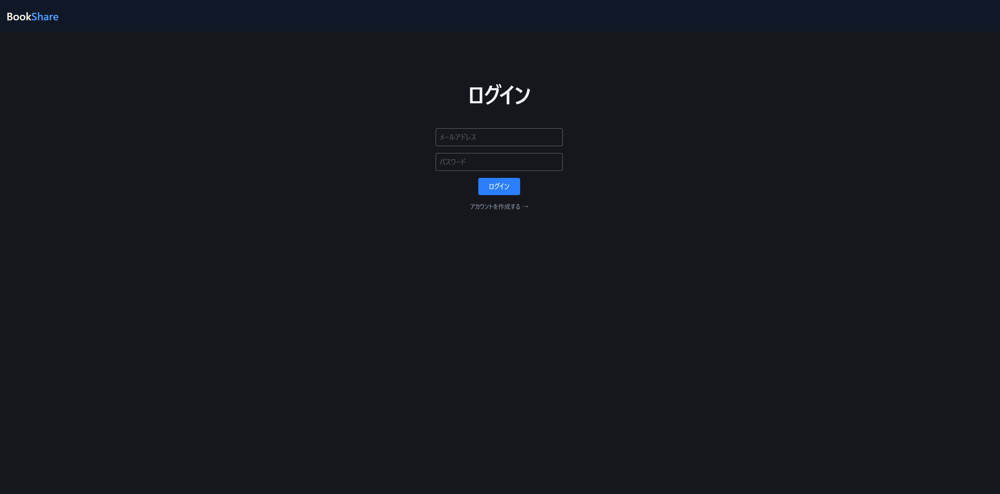
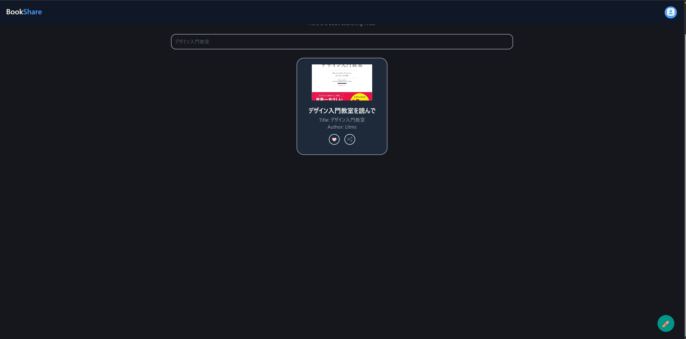
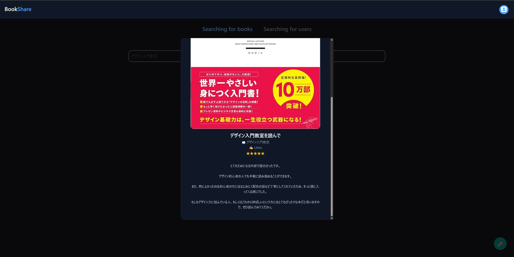
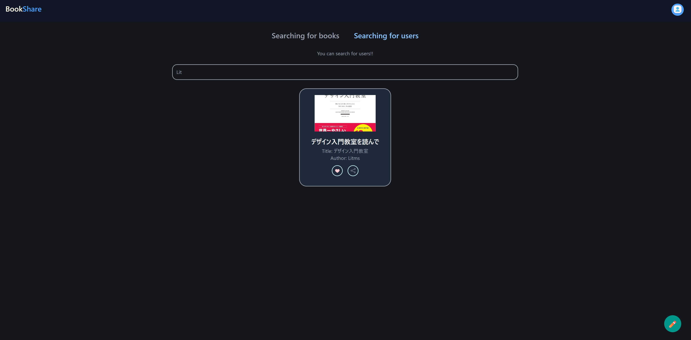

# BookShare 📖

本の感想を投稿・共有できるWebアプリです。
読んだ本の感想を記録したり、他のユーザーの投稿を検索して閲覧することができます。

## イメージ一覧







## 使用技術

### フロントエンド
- React / TypeScript
- TailwindCSS
- use-debounce
- react-icons

### バックエンド
- Python / FastAPI
- SQLite3
- PyJWT（JWT認証）
- pwdlib / Argon2（パスワードハッシュ化）

## 機能一覧

- ユーザー登録・ログイン（JWT認証）
- 書籍感想の投稿（タイトル・書籍名・評価・感想・画像・購入リンク）
- 書籍タイトルによるリアルタイム検索
- ユーザー名によるリアルタイム検索
- 投稿詳細のモーダル表示
- MyBooksから自分の投稿一覧を表示

## セットアップ

### 必要な環境
- Python 3.10以上
- Node.js 18以上
- (backendフォルダの中にuploadsフォルダを作成してください。画像保存用です）

### バックエンド
```bash
cd backend
python -m venv myenv
source myenv/bin/activate  # Windowsの場合: myenv\Scripts\activate
pip install -r requirements.txt
```

`.env` ファイルを作成してください（`.env.example` を参考にしてください）。
```bash
uvicorn main:app --reload --port 9000
```

### フロントエンド
```bash
cd frontend
npm install
npm run dev
```

ブラウザで `http://localhost:5173` を開いてください。

## 環境変数

`.env.example` をコピーして `.env` を作成してください。
```
SECRET_KEY=        # openssl rand -hex 32 で生成
ALGORITHM=HS256
ACCESS_TOKEN_EXPIRE_MINUTES=30
```

## API一覧

| メソッド | エンドポイント | 説明 | 認証 |
|--------|--------------|------|------|
| POST | /users/register | ユーザー登録 | 不要 |
| POST | /user/login | ログイン | 不要 |
| GET | /users/me | 自分の情報取得 | 必要 |
| GET | /users/search | ユーザー名で検索 | 不要 |
| GET | /posts | 投稿一覧取得 | 不要 |
| POST | /posts | 投稿作成 | 必要 |
| GET | /posts/search | 書籍タイトルで検索 | 不要 |

## ディレクトリ構成
```
booksharing/
├── backend/
│   ├── main.py          # エンドポイント定義
│   ├── auth.py          # JWT認証・パスワードハッシュ化
│   ├── database.py      # DB初期化・接続
|   ├── client.py        # テスト用
│   ├── uploads/         # アップロード画像の保存先
│   ├── .env             # 環境変数（Gitに含めない）
│   ├── .env.example     # 環境変数のサンプル
│   └── requirements.txt
└── book-sharing/
    ├── src/
    │   ├── components/  # 共通コンポーネント
    │   ├── context/     # AuthContext
    │   └── pages/       # 各ページ
    └── package.json
```
